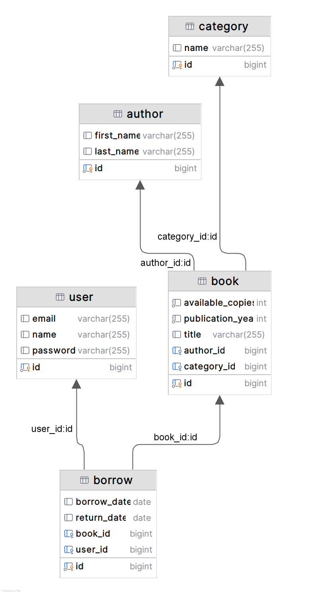

# Library App

Library App to aplikacja webowa służąca do zarządzania wypożyczalnią książek. 

## Cel projektu

Celem aplikacji było:
- zaprojektowanie systemu umożliwiającego zarządzanie zasobami biblioteki
- stworzenie poprawnie zorganizowanej aplikacji warstwowej z wykorzystaniem Spring Boot
- zastosowanie relacyjnej bazy danych, JPA, DTO, walidacji i obsługi błędów
- rozwinięcie umiejętności pracy z REST API i strukturą projektu w praktyce

## Funkcjonalności

- Dodawanie, edytowanie i usuwanie książek
- Zarządzanie kategoriami i autorami
- Obsługa wypożyczeń i zwrotów
- Wyszukiwanie książek dostępnych do wypożyczenia
- Walidacja danych wejściowych
- Obsługa błędów
- Diagram bazy danych w katalogu resources

## Technologie

- Java 17
- Spring Boot 3
- Spring Data JPA
- MySQL (H2)
- Maven
- Lombok
- REST API
- DTO
- Walidacja danych (`@NotBlank`, `@NotNull`, `@Min`)
- Testowanie przez plik .http

## Przykładowe endpointy

- GET `/books` – pobranie listy książek
- POST `/books` – dodanie książki
- GET `/books/available` – lista dostępnych książek
- POST `/borrow` – wypożyczenie książki
- DELETE `/books/{id}` – usunięcie książki

## Diagram bazy danych

